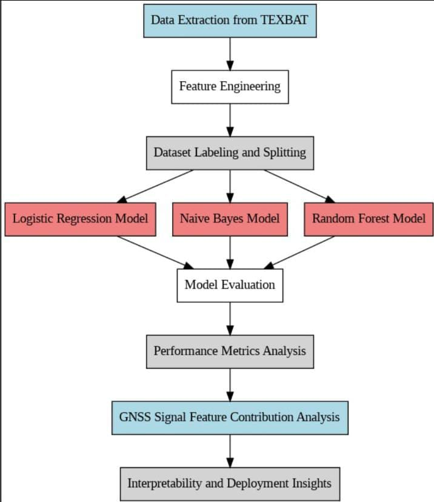
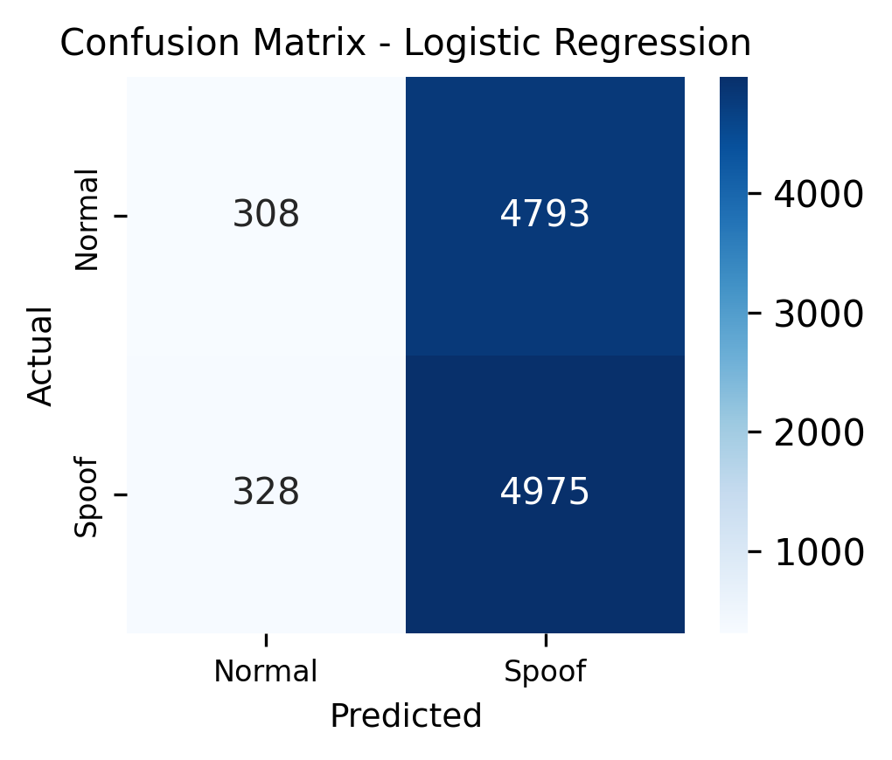
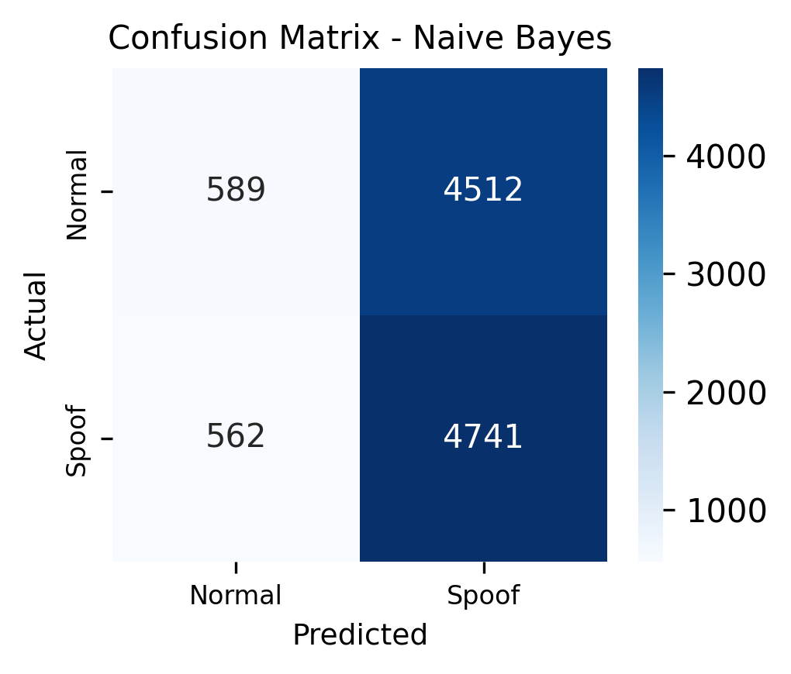
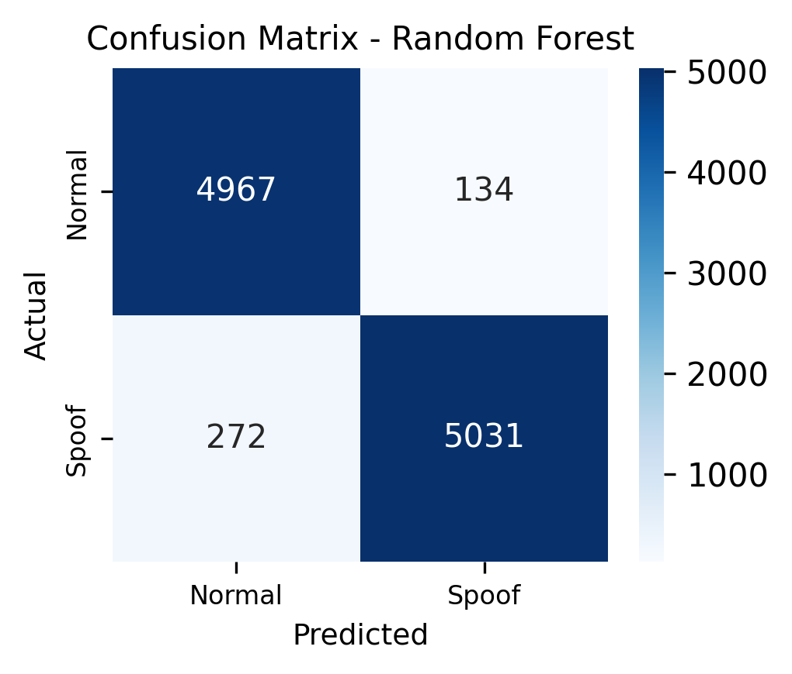
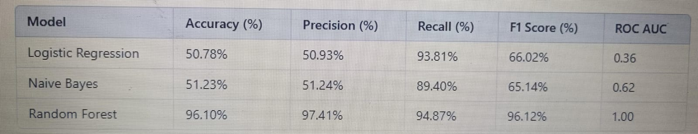
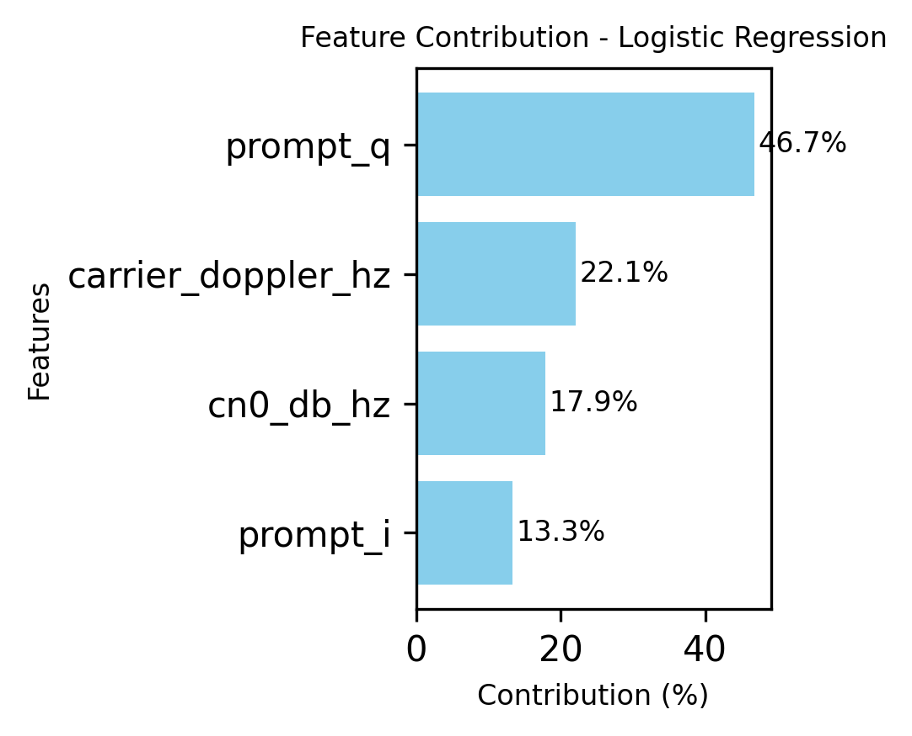
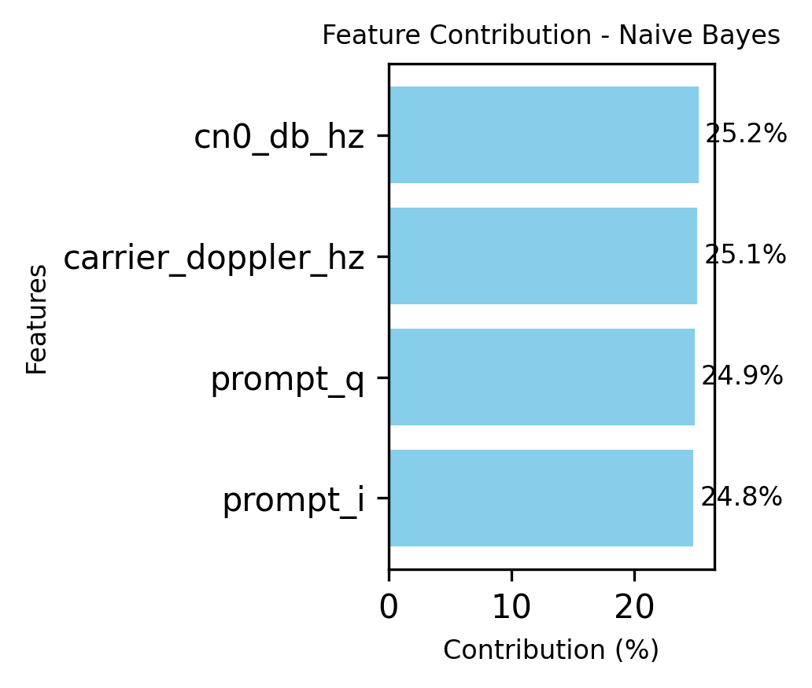
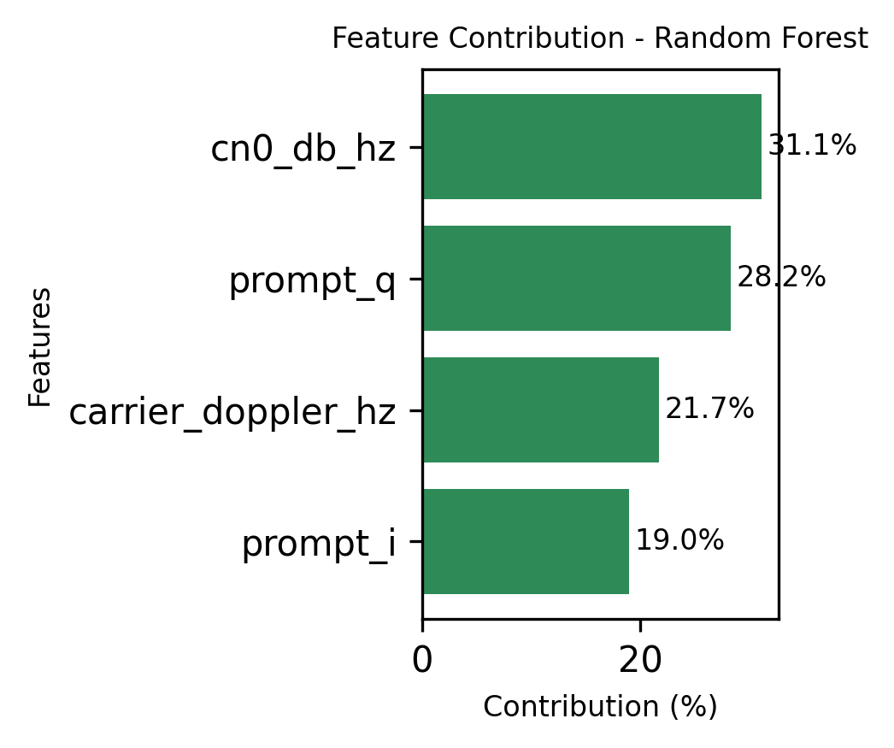

# GNSS-spoofing-detection
I am performing the task of GNSS SPOOOFING DETECTION using algorithms like Random Forest,Logistic Regression,Naive Bayes and found that Random Forest is performing the amazing result with the highest accuracy % of 96.1% compared to others
## Dataset
I have taken the TEXBAT dataset as reference and in that I took the cleanStatic for the authentic data and the ds3 for the spoofed type of data and I combined these two datas into a single labeled data with labeling 0 for the cleanStatic and 1 for the spoofed data and the name of the finalized dataset is labeled_dataset.csv which constitue of 4 main parameters namely:prompt_i, prompt_q, cn0_db_hz, carrier_doppler_hz.

## Designed System Architecture

## EXECUTION
### Step 1:
  Follow the instructions given in the README.md of the dataset folder
### Step 2:
  with the labeled_dataset.csv execute the code in the file named algorithms.py and rocauc.py

## OUTPUTS
After execution of the above codes the output will be as shown below:
### CONFUSION MATRIX OF THE ALGORITHMS
#### LOGISTIC REGRESSION

#### NAIVE BAYES

#### RANDOM FOREST

### ROCAUC
.png)

### TABLE

### MODEL SPECIFIC FEATURE CONTRIBUTION
I have also added Model Specific Feature Contribution which shows us the paramters individual contribution in getting out the output metrics.

#### LOGISTIC REGRESSION

#### NAIVE BAYES

#### RANDOM FOREST

