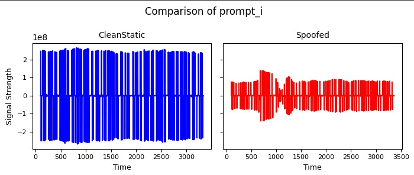
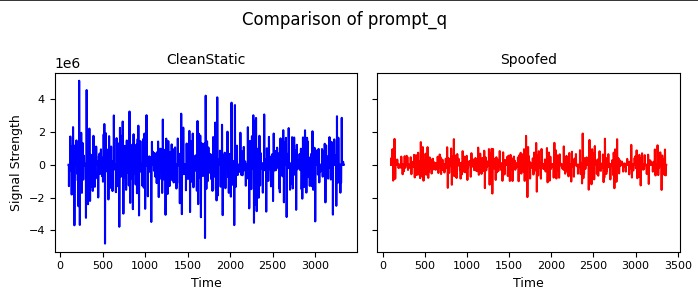
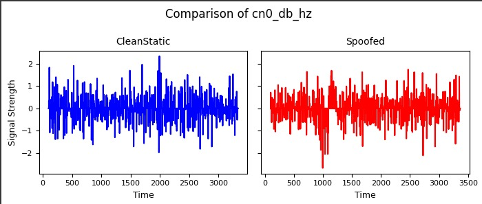
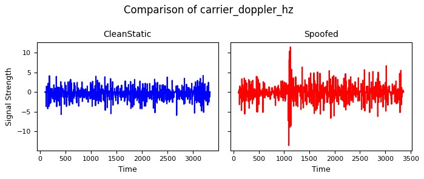

# Dataset
It consist of all the processed data from the TEXBAT datasets and at here after processing I have compared two datasets cs.csv for authentic data and ds3.csv for the spoofed data then I combined two datasets into single dataset named labeled_dataset.csv where the authentic data values are labeled as 0 and the spoofed data values are named as 1.
# Comparison
Here the authentic cs.csv and the spoofed ds3.csv are compared on the basis of 4 main parameters namely:
               1. prompt_i
               2. prompt_q
               3. cn0_db_hz
               4. carrier_doppler_hz
## Comparison of prompt_i

## Comparison of prompt_q

## Comparison of cn0_db_hz

## Comparison of carrier_doppler_hz

